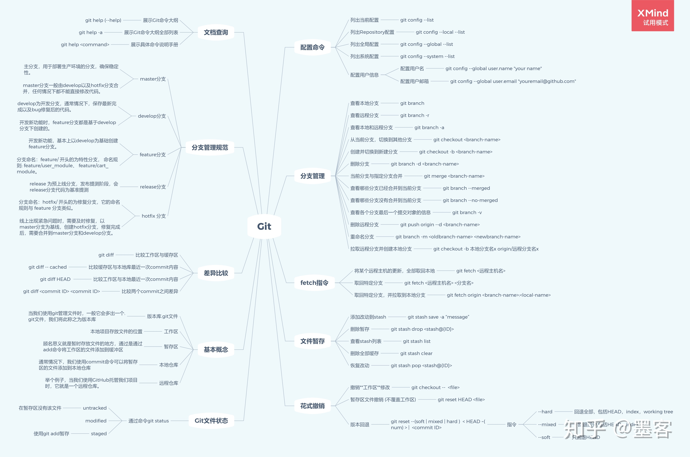

切到 develop 分支，更新 develop 最新代码

git checkout develop
git pull --rebase

新建 feature 分支，开发新功能

git checkout -b feature/xxx
...
git add <files>
git commit -m "feat(xxx): commit a"
git commit -m "feat(xxx): commit b"
# 其他提交
...

如果此时 develop 分支有一笔提交，影响到你的 feature 开发，可以 rebase develop 分支，前提是 该 feature 分支只有你自己一个在开发，如果多人都在该分支，需要进行协调：

# 切换到 develop 分支并更新 develop 分支代码
git checkout develop
git pull --rebase

# 切回 feature 分支
git checkout feature/xxx
git rebase develop

# 如果需要提交到远端，且之前已经提交到远端，此时需要强推(强推需慎重！)
git push --force

上述场景也可以通过 git cherry-pick 来实现，有兴趣的可以去了解一下这个指令。

完成 feature 分支，合并到 develop 分支

# 切到 develop 分支，更新下代码
git check develop
git pull --rebase

# 合并 feature 分支
git merge feature/xxx --no-ff

# 删除 feature 分支
git branch -d feature/xxx

# 推到远端
git push origin develop

当某个版本所有的 feature 分支均合并到 develop 分支，就可以切出 release 分支，准备发布新版本，提交测试并进行 bug fix

# 当前在 develop 分支
git checkout -b release/xxx

# 在 release/xxx 分支进行 bug fix
git commit -m "fix(xxx): xxxxx"
...

所有 bug 修复完成，准备发布新版本

# master 分支合并 release 分支并添加 tag
git checkout master
git merge --no-ff release/xxx --no-ff
# 添加版本标记，这里可以使用版本发布日期或者具体的版本号
git tag 1.0.0

# develop 分支合并 release 分支
git checkout develop
git merge --no-ff release/xxx

# 删除 release 分支
git branch -d release/xxx

至此，一个新版本发布完成。

线上出现 bug，需要紧急发布修复版本

# 当前在 master 分支
git checkout master

# 切出 hotfix 分支
git checkout -b hotfix/xxx

... 进行 bug fix 提交

# master 分支合并 hotfix 分支并添加 tag(紧急版本)
git checkout master
git merge --no-ff hotfix/xxx --no-ff
# 添加版本标记，这里可以使用版本发布日期或者具体的版本号
git tag 1.0.1

# develop 分支合并 hotfix 分支(如果此时存在 release 分支的话，应当合并到 release 分支)
git checkout develop
git merge --no-ff hotfix/xxx

# 删除 hotfix 分支
git branch -d hotfix/xxx

至此，紧急版本发布完成。

# cmd
