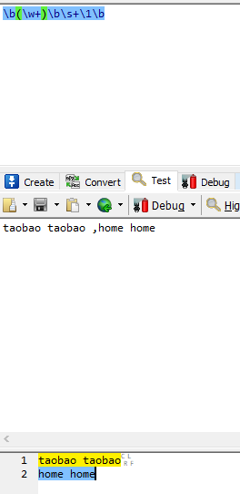

# 一组标题

## 二级标题

### 三级标题

正文可以直接写

换行得在中间空一行

## 代码块
### 单行
`sout.print.out('hello world')`
### 出现在正文中的代码块
``System.out.println("hello world")``可以这样写
### 多行
```kotlin
fun main(){

}
```
## 引用
>www.baidu.com

## 有序列表
1. 123
2. 345
3. 678
   
## 无序列表
- hello
- world

**加粗**

*倾斜*

## 链接
[title](https://www.baidu.com)

## 图片





### 更改图片大小
<image src="http://github.com/hellomr3/notes/raw/master/img/正则反向引用例.png" width="300" height="300"></image>

## 表格
| H1  | H2  |
| --- | --- |
| C11 | C12 |
| C21 | C22 |

### 在标题行包含:可以设置对齐
| HEADER1 | HEADER2 | HEADER3 |
| :------ | :-----: | ------: |
| C11     |   C12   |     C13 |
| C21     |   C22   |     C23 |
## 转义
\\表示转义符 \" \'
## 字体
<font size=8>我是放大</font>

<font size=2>我是缩小</font>
## 兼容Html
<br />
111

